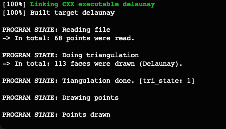

# TC2038-Algorithm-Delaunay
Delaunay Algorithm for TC2038

## Authors
- Eduardo Venegas 
- Pablo Blanco

## Installation

 Make sure you have python3 and pip installed

 Create and activate virtual environment using virtualenv
 ```bash
 $ python -m venv python3-virtualenv
 $ source python3-virtualenv/bin/activate
 $ python3-virtualenv\Scripts\activate (For Windows)
 ```

 Use the package manager [pip](https://pip.pypa.io/en/stable/) to install all dependencies

 ```bash
 pip install -r requirements.txt
 ```

 ## Usage

Run the python script
 ```bash
 $ python3 descriptorPoints.py
 ```  
This will create a ```landmarks.txt``` file with all points from image.

 ## Running c++ file
1. Make sure CGAL, OpenGL and GLUT are installed
2. Run ```cmake -DCMAKE_BUILD_TYPE=Release .```
3. Run ```make```
4. Run ```./delaunay```

## Comments
Se pudieron correr los dos archivos sin problemas, sin embargo dentro del archivo de c++ que hace la triangulación no se muestran de manera gráfica los resultados. Se imprime la cantidad de puntos que se leyeron, además de la cantidad de caras que en teoría serían dibujadas dentro de la pantalla gráfica pero no se muestran dibujadas.

## Results

